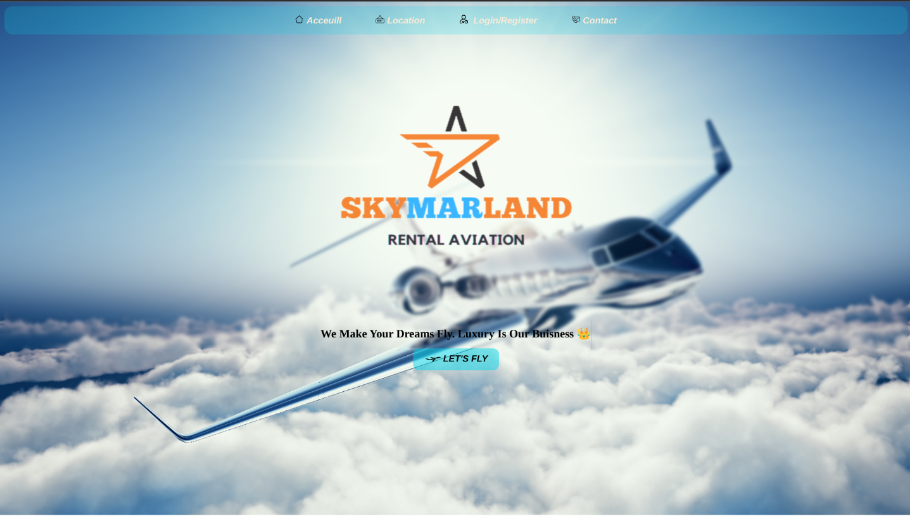

# SkyMarLand  &#128746;

## Description

SkyMarLand is a web application designed to provide a seamless experience for booking private jets. It allows users to browse through a variety of jets, view their specifications, and book them for specific dates. The application is built with a focus on user-friendliness, ensuring that even first-time users can easily navigate through the platform and make a booking. 

The backend of SkyMarLand is built with Node.js and Express, providing a robust and scalable infrastructure. The frontend is designed with Puere HTML,CSS. The application also integrates with a SQL database to store and manage booking data.

Whether you're a frequent flyer or planning your first private jet experience, SkyMarLand aims to make the process as simple and enjoyable as possible.

## Table of Contents

- [Installation](#installation)
- [Usage](#usage)
- [License](#license)

## Installation

To install and set up the project, follow these steps:
 * 1. Clone the repository to your local machine.
 * 2. Navigate to the project directory.
 * 3. Install the required dependencies by running the command: npm install.
 * 4. Configure the project settings by editing the configuration file.
 * 5. Start the project by running the command: npm run dev.
 

## Usage

1. Open your web browser and navigate to the SkyMarLand website.
2. If you're a new user, register for an account by clicking on the 'Sign Up' button. If you're a returning user, click on the 'Log In' button and enter your credentials.
3. Once logged in, you'll be taken to the dashboard. Here, you can view available jets and their specifications.
4. To book a jet, click on the 'Book Now' button next to the jet you're interested in.
5. You'll be taken to a booking page. Here, select your desired dates and enter any additional information required.
6. Review your booking details and click on the 'Confirm Booking' button.
7. You'll receive a confirmation message and an email with your booking details.

Remember to log out of your account once you're done using the application.

For any issues or additional help, please refer to the 'Help' section or contact our support.

## License

MIT License

Copyright (c) [2024] [Mus]

Permission is hereby granted, free of charge, to any person obtaining a copy
of this software and associated documentation files (the "Software"), to deal
in the Software without restriction, including without limitation the rights
to use, copy, modify, merge, publish, distribute, sublicense, and/or sell
copies of the Software, and to permit persons to whom the Software is
furnished to do so, subject to the following conditions:

The above copyright notice and this permission notice shall be included in all
copies or substantial portions of the Software.

THE SOFTWARE IS PROVIDED "AS IS", WITHOUT WARRANTY OF ANY KIND, EXPRESS OR
IMPLIED, INCLUDING BUT NOT LIMITED TO THE WARRANTIES OF MERCHANTABILITY,
FITNESS FOR A PARTICULAR PURPOSE AND NONINFRINGEMENT. IN NO EVENT SHALL THE
AUTHORS OR COPYRIGHT HOLDERS BE LIABLE FOR ANY CLAIM, DAMAGES OR OTHER
LIABILITY, WHETHER IN AN ACTION OF CONTRACT, TORT OR OTHERWISE, ARISING FROM,
OUT OF OR IN CONNECTION WITH THE SOFTWARE OR THE USE OR OTHER DEALINGS IN THE
SOFTWARE.
